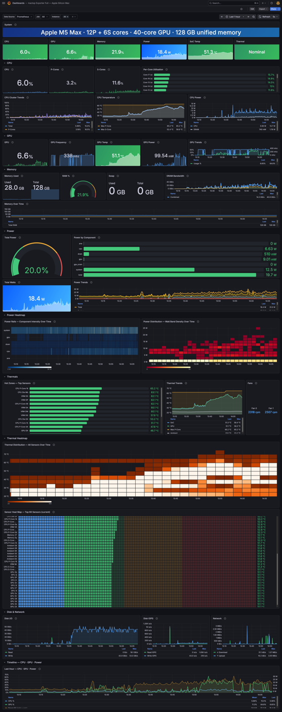

# mactop Exporter — Grafana Dashboard

A comprehensive [Grafana](https://grafana.com/) dashboard for **Apple Silicon Macs**, built on top of [mactop](https://github.com/context-labs/mactop) — a Prometheus metrics exporter for Apple Silicon.

## Features

49 panels across 9 sections:

| Section | What you get |
|---|---|
| **CPU** | Per-core utilisation, cluster utilisation (P-cores · E-cores · S-cores), cluster trends & thermals |
| **GPU** | 40-cell grid utilisation, GPU frequency |
| **Memory** | RAM & swap usage, memory bandwidth |
| **Power** | Per-rail wattage (CPU · GPU · ANE · DRAM · System · Total) |
| **Power Heatmap** | Component intensity over time + watt-band distribution heatmap |
| **Thermals** | All 322 live SMC temperature sensors |
| **Thermal Heatmap** | Temperature distribution over time + top-60 sensor bar gauge |
| **Disk & Network** | Read/write throughput, network in/out |
| **Timeline** | Combined CPU · GPU · Power sparkline history |

## Requirements

- [mactop](https://github.com/context-labs/mactop) running and scraping into **Prometheus**
- **Grafana 10+** (tested on 12.4.0)

## Installation

1. In Grafana, go to **Dashboards → Import**
2. Upload `mactop_exporter_v1.json`
3. Select your Prometheus datasource
4. Click **Import**

## Known mactop quirks

- `mactop_network_kbytes_per_sec` actually reports **bytes/sec** (off by 1024×) — labelled accordingly in the dashboard
- VRM MD sensor (`TVMD`) is permanently stuck at **1 °C** — this is an Apple SMC "not available" sentinel, not a real reading. All other 322 sensors report live data.

## License

MIT — see [LICENSE](LICENSE)
